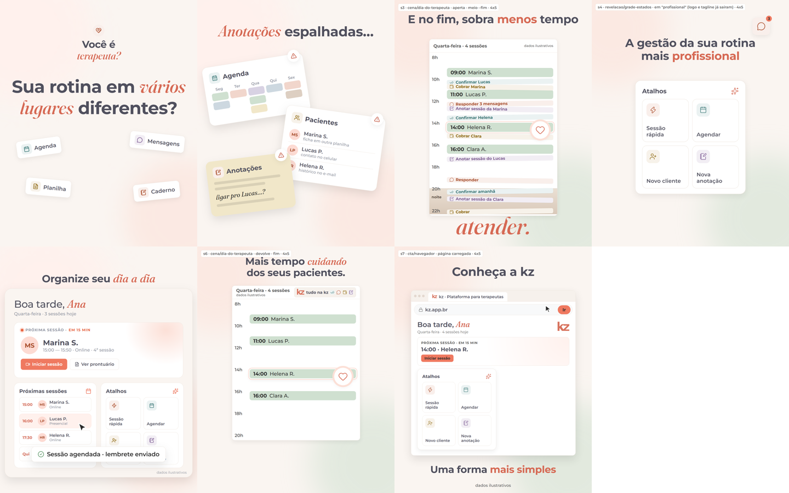
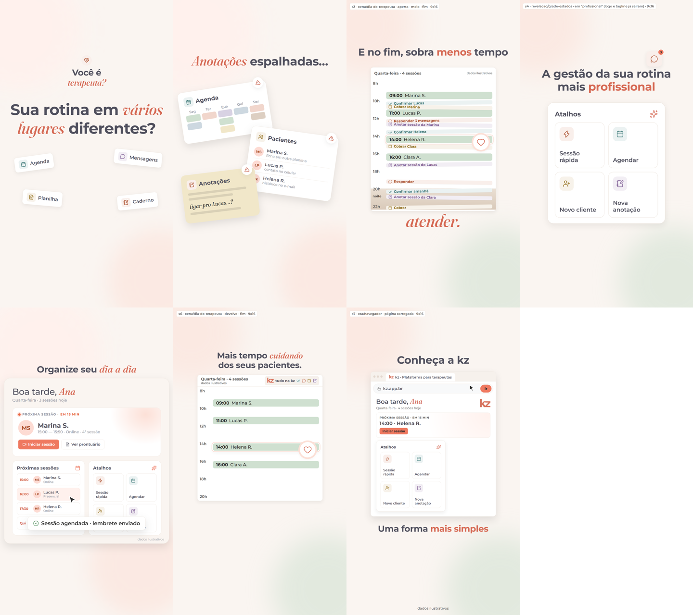

# Plano — kz · apresentação, "As peças da rotina"

> Empresa: kz · Nível: médio · Formato: livre (apresentação) · Duração: ≈ 43 s (voz de rascunho Thalita; a Carla da v03 tem ≈ 44 s) · Formatos: 4:5, 9:16 · Áudio: locução + trilha + efeitos
> Entrada: roteiro da v03 (falas f1–f7 sem mudar o texto) · Status: **aguardando aval** · Data: 2026-10-08
> Máquina: `cenas.json` (fonte da verdade) · Tarefa 047 fase B: o mesmo roteiro da v03, planejado com a skill `plano-de-cenas`, para comparar.
> Há um 2º plano da fase B, feito em paralelo por outra sessão: `2026-10-08-apresentacao-kz-plano/` (conceito "Uma janela só").

## 1. Recorte
A kz junta num lugar só a rotina espalhada do terapeuta autônomo e devolve o tempo de atender.

## 2. Conceito
**Escolhido: As peças da rotina.** A rotina são 4 peças soltas que se espalham, comem o dia e, na kz, se encaixam no painel.
- **Motivo:** 4 peças com identidade fixa, nos tons reais dos Atalhos do app: Agenda (teal), Pacientes (âmbar), Anotações (lilás), Mensagens (coral). Mais a **coluna do dia**.
- **Evolução:**
  - s1: as peças estão apagadas em arco e acendem;
  - s2: viram 3 cards que falam da mesma paciente e se contradizem;
  - s3: viram tarefas que enchem o dia até a noite;
  - s4: se alinham numa grade e viram o card Atalhos;
  - s5: a câmera sai do card para o painel, e Mensagens vira o toast do WhatsApp;
  - s6: o mesmo dia da s3, com as tarefas recolhidas e a noite clara;
  - s7: o navegador abre esse painel.
- **Transição:** match no motivo (inclui a câmera contínua s4→s5) e hard cut na batida (inclui s5→s6, o callback "lembra disso?").
- **Curva de intensidade:** 3 · 2 · 2 · 4 · 2 · 3 · 1.
- **Não vamos fazer:** relógio, pessoa frustrada no notebook, gráfico subindo, foguete, partícula festiva, logo de terceiros.
- **Alternativas:**
  - "O dia em fast-forward": mais forte na dor, mais fraco no produto.
  - "Abas abertas": mais literal, menos acolhedor.

## 3. O que muda em relação à v03
- **Fio condutor:** a v03 tinha um recurso diferente por cena; aqui as mesmas peças atravessam o vídeo inteiro.
- **s3:** sai o relógio literal (que deu bug na v02). Entra o dia dela: as sessões continuam do mesmo tamanho, mas as tarefas enchem todos os vãos e a noite.
- **s6:** sai "riscar + coração". Entra a consequência visível da s3: o mesmo dia, com as sessões paradas nas mesmas horas e os vãos limpos.
- **s4:** saem as pílulas com os adjetivos. Os adjetivos viram estados da grade: alinha, ganha os rótulos reais, vira o card Atalhos.
- **s7:** o navegador (Padrões do Oliver) carrega o mesmo painel do vídeo.
- **Toast verdadeiro:** "Confirmação enviada no WhatsApp" no lugar de "lembrete enviado", que estava a confirmar desde a v03.

## 4. Falas
As 7 da v03, sem mudança. Na voz, kz se lê "cá-zê" (`say`). ≈ 43 s.

## 5. Storyboard

v03 com a mesma regra de quadro: `comparacao/v03-4x5.png`.
**Como ler:**
- s3, s4, s6 e s7 são style frames dos blocos novos (rótulo cinza no canto).
- s1, s2 e s5 ainda mostram os blocos como estão hoje. O que muda neles depois do aval está em "Ajustes de bloco".

| cena | tempo | int. | relação | o que a imagem acrescenta | bloco |
|---|---|---|---|---|---|
| s1 gancho | 0–5,0 | 3 | complementa | "vários lugares" vira 4 peças concretas, presentes desde o 1º quadro, que se separam | `abertura/pergunta-fragmentos` + ajuste |
| s2 dor | 5,0–10,3 | 2 | complementa | 3 cards da mesma paciente que se contradizem; a linha que tenta ligá-los se rompe | `cena/caos-cards` + ajuste |
| s3 dor | 10,3–15,8 | 2 | complementa | o dia dela sem nenhum branco entre as sessões, transbordando para a noite | **novo** `cena/dia-do-terapeuta` (aperta) |
| s4 revelação | 15,8–23,4 | 4 | mostra | os adjetivos viram estados da grade, que vira o card Atalhos | **novo** `revelacao/grade-estados` |
| s5 produto | 23,4–29,7 | 2 | prova | o painel de verdade; a peça Mensagens vira a confirmação no WhatsApp | `produto/painel-inicio` + ajuste |
| s6 virada | 29,7–34,9 | 3 | contrasta | o mesmo dia, devolvido: só as tarefas saem | **novo** `cena/dia-do-terapeuta` (devolve) |
| s7 cartão | 34,9–42,9 | 1 | mostra | a aba abre, kz.app.br é digitado e carrega o mesmo painel | **novo** `cta/navegador` (vem de `library/motion/cta/navegador`) |

Ficha completa de cada cena (poses, palavra que dispara cada gesto, entrada e saída, som): `cenas.json`.

## 6. Cor e fundo
- **Fundo:** creme `--bg` em todas as cenas, com os blobs da marca.
- **Ênfase:** 1 palavra por título em `--accent`; "atender." e "cuidando" em Fraunces.
- **Peças:** os 4 tons de tile do app; sessões em sage.
- **Contraste:**
  - "dados ilustrativos" em `--muted` (6,37:1);
  - botão Ir com `--on-primary` sobre coral (5,11:1);
  - nada de `--danger` junto do coral.

Conferido contra o `BRAND.md`.

## 7. Afirmações
| afirmação | fonte |
|---|---|
| plataforma feita para terapeutas · kz.app.br | título do site |
| painel com próxima sessão, sessões do dia e Atalhos (Sessão rápida, Agendar, Novo cliente, Nova anotação) | `PRODUTO.md` > Painel do dia; print do painel 2026-10-07 |
| confirmação de sessão no WhatsApp | `PRODUTO.md` > Comunicação/WhatsApp (pronta) |
| confirmar, cobrar e anotar na kz (chip "tudo na kz") | `PRODUTO.md` > Confirmação · Cobrança por cliente (controle, não meio de pagamento) · Anotações |
| a administração vai para os intervalos e a noite | `AUDIENCE.md` > Rotina |
| Ana, Marina S., Lucas P., Helena R., Clara A. | elenco fictício, um dia só (`cenas.json` > `elenco`), "dados ilustrativos" |

## 8. Revisão crítica
| rodada | nota | o que mudou |
|---|---|---|
| 1 (`revisao-plano-1.md`) | 21/36 | peças com identidade fixa; s2 com contradição; tarefas nos intervalos (sessões fixas); s4 sem pílulas; hard cut s5→s6; navegador na s7 |
| 2 (`revisao-plano-2.md`) | 25/36 | um dia e uma escala; s3 sem branco; s6 com sessões paradas; card Atalhos com a mesma geometria na s4/s5/s7; style frames 9:16 de verdade; contraste do Ir |
| 3 (`revisao-plano-3.md`) | **28/36, passa** | 2 bloqueantes mecânicos corrigidos sem nova rodada: área segura do 9:16 (coluna a ~55 px/h, "atender." até y 1440, janela da s7 em x 150–930, coração e balão para dentro) e contraste ("noite" #5a4d42 5,05:1; badge #2b2b2b sobre coral 5,11:1); spec da s3/s6 unificado; card Atalhos = o do painel em escala na s4 e na s7 |

**Recusado, e por quê:**
- **Cauda de 0,7 s na s6 (rodadas 2 e 3):** deixava 0,85 s de silêncio antes da s7, e o limite é 0,5 s (o `check` acusa). Fica 0,35 s; o respiro vem da cauda de 3 s da s7.
- **Quadro 0 da s1:** depende do ajuste do bloco; fica para depois do aval.
- **"Mensagens pousa como atalho":** no painel real, o atalho coral é Sessão rápida. Por isso Mensagens vira o toast, e Sessão rápida entra na grade como o que faltava.

## 9. Ajustes de bloco (depois do aval)
| bloco | o que muda |
|---|---|
| `abertura/pergunta-fragmentos` | params `fragmentos` (ícone, rótulo, tom), `apagadas` (peças em arco no 1º quadro) e `detalhes` ("Qui 14h", "3") |
| `cena/caos-cards` | params `conteudo`, `ligacao` (linha que se rompe) e `alerta` em `--ink` (sai o `--danger`); Mensagens pequena no canto |
| `produto/painel-inicio` | `de_atalhos` (começa com a câmera no card Atalhos); toast "Confirmação enviada no WhatsApp" nascendo da peça Mensagens; `elenco` (4 sessões, Helena 14:00 em 15 min) |
| novos | `cena/dia-do-terapeuta` (aperta/devolve), `revelacao/grade-estados`, `cta/navegador` (promover `library/motion/cta/navegador` a bloco serve a todos os vídeos) |

## 10. Perguntas ao Oliver
0. **A s7 carrega um painel logado ("Boa tarde, Ana") em kz.app.br**, mas um visitante novo vê a página de venda ou o login. Recomendo carregar a página de entrada real com a logo grande (resolve também a falta de logo grande no fim, pergunta 3). Preciso de um print dela.
1. **"As peças da rotina" ou "Uma janela só" (o plano da outra sessão)?** Recomendo "As peças da rotina": o callback do mesmo dia (s3 → s6) e a grade que vira o card Atalhos real ligam a dor ao produto. Vale olhar os dois storyboards lado a lado.
2. **A s6 perde a frase gigante com coração da v03 e vira uma agenda devolvida.** Recomendo manter a agenda, que é a prova visual do "mais tempo", e deixar o coração e a ênfase *cuidando* grandes.
3. **O fim fica sem logo grande** (a s4 é o momento da marca e a logo sai em "profissional"). Se a resposta da pergunta 0 for o painel, recomendo que, na cauda, a logo do cabeçalho cresça e venha para o centro (gesto `fecha`). Antes dizia: "O cartão final perde a logo grande (ela fica no cabeçalho da página e na aba).** Recomendo que, na cauda, a logo do cabeçalho cresça e venha para o centro nos últimos 1,2 s (gesto `fecha`).

## 11. O que olhar no aval (da revisão 3)
- **Densidade da s3:** 11 tarefas com texto de 22 px. No celular, viram textura e quase não se leem. É a intenção (o dia sem espaço), mas a escolha é sua.
- **s2:** continua perto da v03. É a cena mais fraca que sobra; o ganho está nos dados que se contradizem ("Qui 14h" × "remarcou p/ sexta?") e na linha que se rompe.
- **Riscos de produção:**
  - o zoom da s4 para a s5 parte do painel a ~2,5× e só fica nítido porque o bloco é HTML vetorial;
  - a s6 tem 4 mudanças em ~3,9 s; se ficar apertada, a primeira coisa a tirar é a coluna encolhendo;
  - o quadro 0 da s1 e o fim da s3 (câmera a 1,3×) só aparecem no render: exigir os dois na folha do QC.
