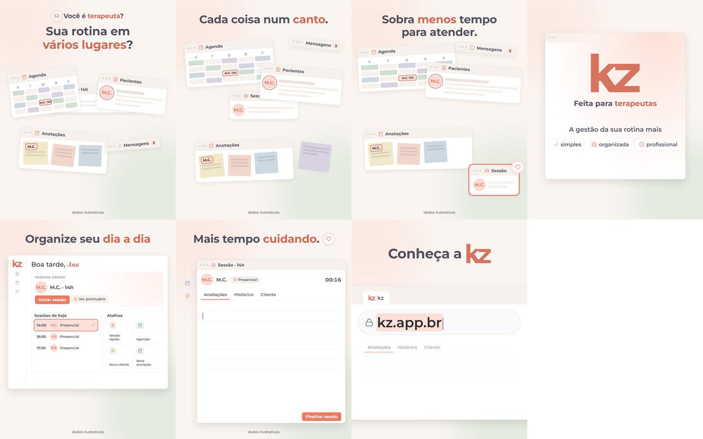
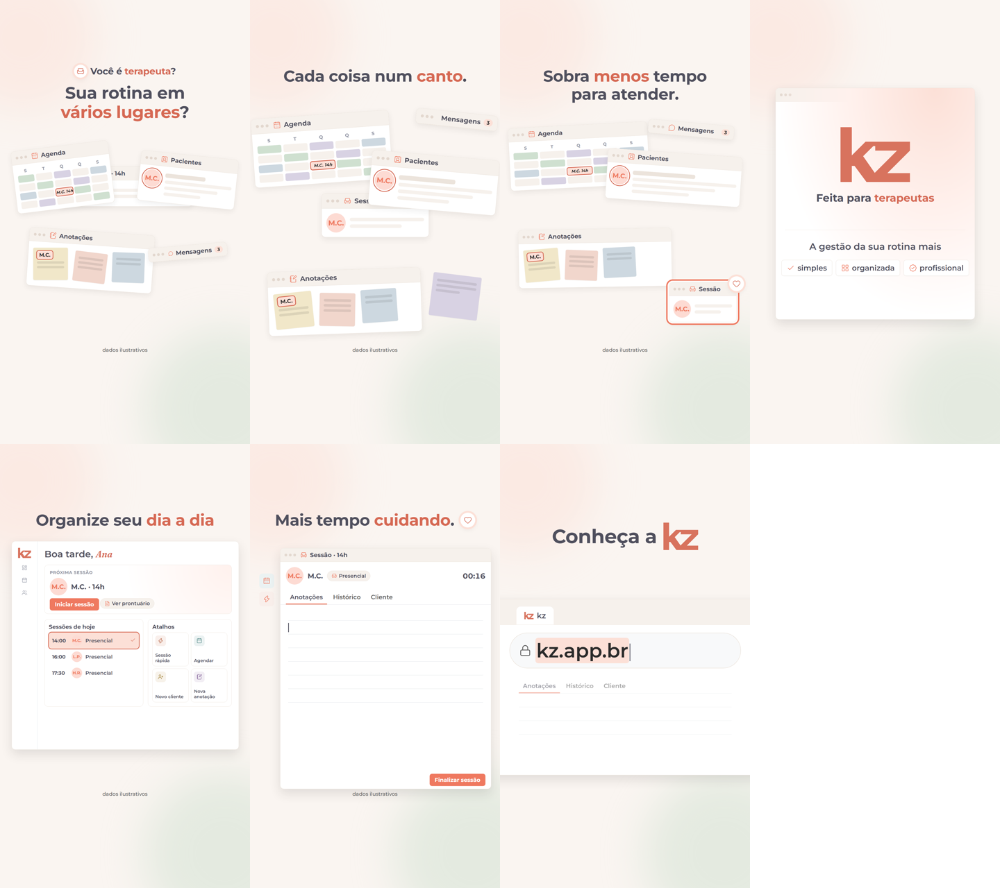

# Plano — kz · apresentação (refeito pela skill plano-de-cenas)

> Empresa: kz · Nível: médio · Formato: livre (apresentação) · Duração: ≈ 44 s (41,4 s de voz + 2,6 s de cauda) · Formatos: 4:5, 9:16 · Áudio: locução final (Carla, Eleven v4) + trilha + efeitos
> Entrada: roteiro já gravado (`2026-10-07-apresentacao-kz/timeline.json` > `vo[]`, tags v4 no `plano.md` de lá); wav e tempos por palavra em `audio/vo/split/` · Status: **aguardando aval** (revisão: rodada 1 22/36 → rodada 2 28/36, passou) · Data: 2026-10-08
> Máquina: `cenas.json` (fonte da verdade; este arquivo é a leitura humana dele). Tarefa 047 fase B: comparar com a v03 (quadros em `comparacao/v03-4x5.png`).

## 1. Recorte
Para a terapeuta autônoma que vive com a rotina espalhada em vários lugares: a kz junta tudo numa janela só e devolve o tempo de atender.

## 2. Conceito
**Escolhido: Uma janela só.** A rotina é uma área de trabalho em que as janelas da gestão cobrem a sessão e a empurram para o canto. A kz junta tudo numa janela só, que vira o painel, depois a sessão inteira, e no fim se revela o navegador em kz.app.br.

**Motivo: a janela.** Como evolui:
1. s1: a Sessão (M.C., 14h) está calma no centro, e 4 janelas da rotina pipocam por cima.
2. s2: a mesma paciente aparece partida em 3 janelas.
3. s3: a Sessão é empurrada para o canto, e tudo encaixa numa janela única.
4. s4: a logo nasce dentro dela.
5. s5: a janela vira o painel, e cada conteúdo encaixa num módulo.
6. s6: a Sessão ocupa a janela inteira.
7. s7: a câmera recua, e a janela era o navegador em kz.app.br.

**Por que este:**
- As falas são espaciais ("de um lado", "de outro", "espalhadas").
- A Sessão é o mesmo objeto em s1 (centro), s3 (canto) e s6 (tela cheia).
- O CTA fecha o motivo.

**Transição:** match no motivo, com J-cut do som só na revelação. Sem dissolve, sem efeito.
**Curva:** 3 · 3 · 2 · 4 · 2 · 3 · 1.

**Não vamos fazer:**
- foguete, gráfico subindo, lâmpada, aperto de mão;
- frustrado no notebook, relógio derretendo;
- logos de terceiros;
- alerta vermelho;
- lembrete automático e cobranças;
- nome, rosto ou texto clínico de paciente;
- reveal genérico;
- aba nova ou página do site desenhada no CTA;
- fundo pastel.

**Alternativas:**
- **O dia que respira:** a coluna de horários é o motivo. Forte em "tempo", fraco em "vários lugares".
- **Peças que se juntam:** fragmentos que viram o painel. É a lógica da v03 com um fio contínuo.

## 3. O que muda em relação ao anterior (v03)
- **Fio condutor:** a v03 tinha 7 recursos diferentes sem fio. Aqui a janela liga tudo por match.
- **Headlines:** na v03 trocavam palavra a palavra. Aqui cada headline entra inteira.
- **s3:** a v03 usava um relógio. Aqui o que encolhe é a própria sessão.
- **Revelação:** a v03 fazia a logo no vazio. Aqui ela nasce dentro da janela única.
- **s6:** a v03 riscava a frase. Aqui a tela de atendimento real ocupa tudo.
- **CTA:** a v03 tinha um botão com a URL. Aqui a câmera recua e mostra que tudo já estava em kz.app.br.
- **Toast:** saiu o "lembrete enviado" (sem fonte); no lugar, M.C. acende em Sessões de hoje, com um check.
- **Reaproveitado:** `pergunta-fragmentos` e `painel-inicio`, os dois com params novos (`ajuste_bloco`).

## 4. Falas (tempos reais da Carla)
| id | texto exato | palavras | início–fim |
|---|---|---|---|
| f1 | Você é terapeuta e ainda organiza sua rotina em vários lugares diferentes? | 12 | 0,35–4,89 |
| f2 | Agenda de um lado, informações dos pacientes de outro, anotações espalhadas… | 11 | 5,24–11,39 (suspiro de ~0,8 s antes de "Agenda") |
| f3 | E no fim, sobra menos tempo para aquilo que realmente importa: atender. | 12 | 11,79–16,59 |
| f4 | A kz é uma plataforma feita para terapeutas que querem deixar a gestão da rotina mais simples, organizada e profissional. | 20 | 17,44–24,92 (respiro de 0,85 s antes) |
| f5 | Tudo pensado para você acompanhar seus atendimentos e organizar seu dia a dia com muito menos complicação. | 17 | 25,37–31,59 |
| f6 | Menos tempo administrando. Mais tempo cuidando dos seus pacientes! | 9 | 32,09–36,34 |
| f7 | Conheça a kz e descubra uma forma mais simples de cuidar da sua rotina profissional. | 15 | 36,79–41,44 |

Total: 96 palavras. São 41,4 s de voz real, ≈ 44 s com a cauda. O `check` ainda estima a 2,7 palavras/s; os tempos reais entram na timeline por `fit-vo.mjs --dir audio/vo/split`.

## 5. Storyboard
 ·  · comparação com a v03: `comparacao/v03-x-janela-4x5.png` + `comparacao/COMPARACAO.md`

Os 7 quadros são style frames estáticos (`style/gerar.mjs`, brand.css real, Lucide) na pose assentada. s1 e s5 também têm style frame, porque o build monta o bloco existente sem os ajustes planejados. Tempos: timeline com a voz real da Carla (`fit-vo --dir audio/vo/split`), e todos os gestos caem a −0,06…−0,12 s da palavra (offset planejado).

| cena | tempo real | int. | relação | o que a imagem acrescenta | bloco |
|---|---|---|---|---|---|
| s1 | 0,0–5,1 | 3 | complementa | a sessão calma no centro e coberta pelas 4 janelas da rotina | `abertura/pergunta-fragmentos` + params |
| s2 | 5,1–11,6 | 3 | complementa | a mesma paciente partida em agenda, ficha e post-it; as 3 marcas acendem juntas | novo `cena/janelas-abrem` |
| s3 | 11,6–17,3 | 2 | complementa | a sessão empurrada para o canto; tudo encaixa numa janela única | novo `cena/janelas-espremem` (irmão do anterior, mesmas posições) |
| s4 | 17,3–25,2 | 4 | complementa | a logo nasce dentro da janela única; a frase volta inteira e os chips têm ícone que combina com a palavra | novo `revelacao/janela-unica` |
| s5 | 25,2–31,9 | 2 | prova | os 3 conteúdos encaixam nos módulos; M.C., que estava em 3 lugares, aparece 1 vez (acende, com check) | `produto/painel-inicio` + params |
| s6 | 31,9–36,6 | 3 | contrasta | a sessão que estava espremida ocupa a janela inteira | novo `virada/sessao-ocupa-tudo` |
| s7 | 36,6–43,7 | 1 | complementa | tudo acontecia no navegador; a câmera vai a 1,8× na URL, logo na headline | novo `cta/navegador` (modo revelar, sem aba nova) |

### Ficha por cena

**s1 · gancho:** a sessão coberta pela gestão.
- Poses:
  - início: Sessão no centro + selo e "Você é *terapeuta*?" no 1º quadro;
  - meio: a pergunta sobe e "Sua rotina em *vários lugares*?" entra;
  - fim: Agenda, Pacientes, Anotações e Mensagens por cima da Sessão.
- Gestos: 1º quadro → pergunta · "ainda" → troca · "vários" → janelas pipocam.
- Ícones: `armchair`, `video`, `calendar-days`, `contact-round`, `notebook-pen`, `message-circle`.
- Som: whoosh fino, swish, 4 pops.

**s2 · dor:** cada coisa num canto, inclusive a mesma paciente.
- Poses:
  - início: "Cada coisa num *canto*." inteira, janelas assentando no suspiro;
  - meio: Agenda com "M.C. 14h" e ficha de M.C.;
  - fim: post-it "M.C.", com as 3 marcas acesas em `--accent`.
- Gestos: "Agenda" · "informações" · "anotações" · "espalhadas" → marcas acendem.
- Som: air, pops de janela, papel, ticks + whoosh fino.

**s3 · dor:** a sessão é o que fica espremido.
- Poses:
  - início: "Sobra *menos* tempo para atender." inteira, Sessão saindo de trás;
  - meio: Sessão no canto, ainda encolhendo;
  - fim: tudo parado, só o anel coral pulsa; depois tudo encaixa numa janela única a ~30%.
- Gestos: "menos" → espreme · "aquilo" → segundo empurrão (Sessão a ~30%) · "atender" → pausa de 0,4 s + anel · fim → encaixe.
- Som: pop, compressão, ding sozinho, encaixe e silêncio.

**s4 · revelação:** a kz nasce dentro da janela única.
- Poses:
  - início: janela única parada no silêncio;
  - meio: em "kz" a janela abre e a logo se desenha dentro, com brilho `--ui-glow` no canto e "Feita para *terapeutas*";
  - fim: em "gestão" o rodapé se abre com "A gestão da sua rotina mais"; depois 3 chips (`check` simples, `layout-grid` organizada, `badge-check` profissional).
- Som: riser em J-cut, impacto suave com piano, pop, air, 3 pops.

**s5 · produto:** as janelas viram módulos.
- Poses:
  - início: a janela vira a moldura do painel, a logo vai para a barra lateral e entra "Acompanhe seus *atendimentos*";
  - meio: em "pensado", grade, ficha e post-it encaixam em Sessões de hoje, Próxima sessão e Nova anotação, e a câmera vai a 1,3× no card;
  - fim: "Organize seu *dia a dia*"; a câmera desce para Sessões de hoje, "M.C. 14h" acende em `--accent` e ganha um check em "complicação".
- Som: whoosh, 3 encaixes, air, clique, ding.

**s6 · virada:** a sessão ocupa tudo.
- Poses:
  - início: "Menos tempo *administrando*." sobre o painel;
  - meio: Sessões de hoje e Atalhos viram chips e o cursor clica em "Iniciar sessão";
  - fim: tela de atendimento inteira, modo Presencial (iniciais M.C., relógio, Anotações em primeiro plano), "Mais tempo *cuidando*." com coração.
- Som: swish, clicks, clique + air, pop com brilho.

**s7 · cartão final:** era o navegador.
- Poses:
  - início: a câmera recua da sessão;
  - meio: navegador em kz.app.br com "Conheça a" + logo no topo; em "kz" a câmera vai a 1,8× na barra e a URL fica selecionada;
  - fim: em "simples" um traço de brilho passa pela logo da headline; em "profissional" a seleção vira o cursor de texto piscando; cauda de 2,2 s parada na barra.
- Textos: só "Conheça a" + logo e "kz.app.br".
- Som: air de recuo, pop, clique leve, brilho, trilha resolve.

## 6. Cor e fundo por cena
| cena | fundo | ênfase |
|---|---|---|
| s1–s7 | `--bg` liso + `fundo/blobs` (não muda) | 1 palavra em `--accent` por headline |
| s2–s3 | janelas `--surface`, `--border`, `--shadow-md`; categorias em `--tile-*` | marcas M.C. em `--accent`; sem vermelho ou amarelo |
| s3 | — | anel da Sessão em `--primary` (ponto) |
| s4 | janela única `--surface` + `--ui-glow` no canto | logo `--logo` |
| s5–s6 | UI nos tokens "UI do app" | botão coral com texto branco só na tela recriada |
| s7 | navegador `--surface`/`--surface-2` | seleção da URL em `--accent` |

Conferido contra o `BRAND.md`: sim.

## 7. Afirmações sobre o produto
| afirmação | fonte | status |
|---|---|---|
| plataforma feita para terapeutas | BUSINESS.md | ok |
| painel do dia (próxima sessão, sessões de hoje, atalhos) | PRODUTO.md > Painel do dia + `brand/screenshots/painel-inicio-2026-10-07.png` | ok |
| tela de atendimento (vídeo, relógio, abas, Finalizar sessão) | PRODUTO.md > Tela de atendimento | ok |
| roda no navegador em kz.app.br | BUSINESS.md + PRODUTO.md (web, sem app mobile) | ok |
| lembrete automático · cobranças | — | **fora do plano** |

Dados ilustrativos: terapeuta Ana e paciente M.C., só com iniciais. O aviso vai no rodapé.

## 8. Revisão crítica
- **Rodada 1** (`revisao-plano-1.md`): 22/36, não passou.
  - Aplicado: Sessão no 1º quadro; M.C. em 3 lugares; janela única no lugar do ponto; s4 `revelacao/janela-unica`; sem cobranças; paciente só com iniciais; s7 sem aba nova.
  - Recusado: fundo pastel (BRAND.md).
- **Rodada 2** (`revisao-plano-2.md`): 28/36, passou.
  - Aplicado: spec da s4 e `revisao[0]` corrigidos; s4 com a frase de volta e ícones `check`/`layout-grid`/`badge-check`; s5 sem clique nem toast (M.C. acende); s7 com zoom de 1,8× na URL e logo na headline; Sessão sem tile de vídeo e s6 no modo Presencial.
  - Recusado: s4 com miniaturas (repete o encaixe da s5 1 s depois).
- **Check (Node 22):** 0 ✗ · 0 ⚠.

## 9. Perguntas ao Oliver
1. **A videochamada da tela de atendimento funciona?** Recomendo manter Presencial (sem vídeo) até confirmar. Se funcionar, a s6 pode mostrar o vídeo com iniciais (`modo: online`).
2. **A s7 fecha numa barra de endereço** (URL grande, logo na headline), não num cartão com botão como a v03. Recomendo testar assim. Se achar fraco como CTA, a alternativa é encolher o navegador e entrar o cartão com botão da v03 embaixo.
3. **Tipografia:** os style frames usam só Montserrat. Recomendo trazer o Fraunces itálico da v03 (1 palavra por tela: "terapeuta", "atender", "cuidando"): é onde a v03 está mais quente (ver `COMPARACAO.md`).
4. **5 blocos novos + ajustes em 2 existentes** (`pergunta-fragmentos`, `painel-inicio`). Recomendo fazer todos. O `cta/navegador` e os params do painel (sem o toast fixo) servem para outros vídeos.
5. **Elenco fictício:** terapeuta Ana, paciente M.C. (só iniciais). Recomendo registrar no BRAND.md, onde o elenco ainda está "a definir".
6. **Mensagens** (s1–s3) é absorvida e não vira nada depois. Recomendo deixar assim: não há módulo de mensagens com fonte.

---
## Entrega (a skill `video` preenche no fim)
- Arquivos · Medições · Não verificado · Em aberto · Feedback do Oliver
